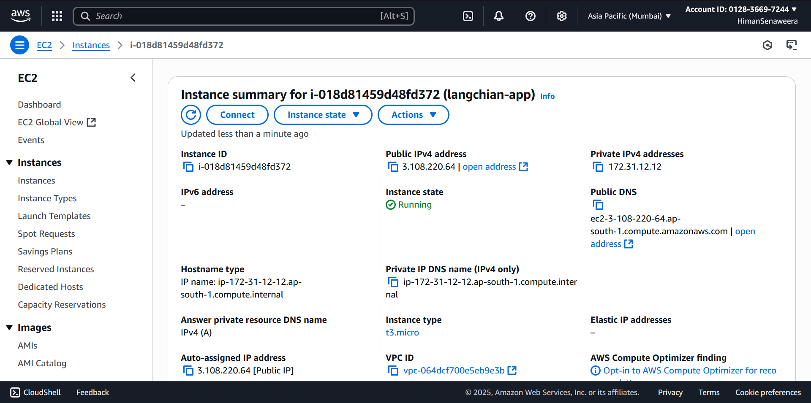
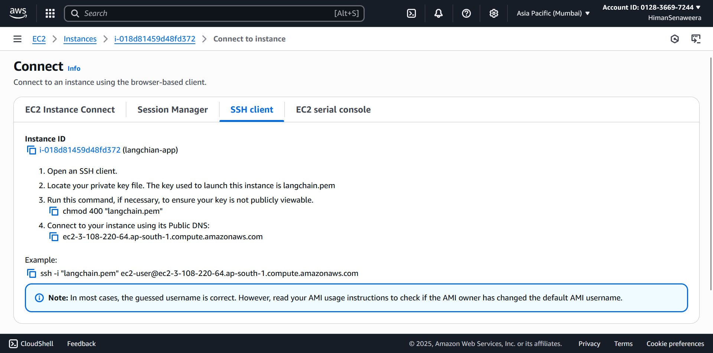
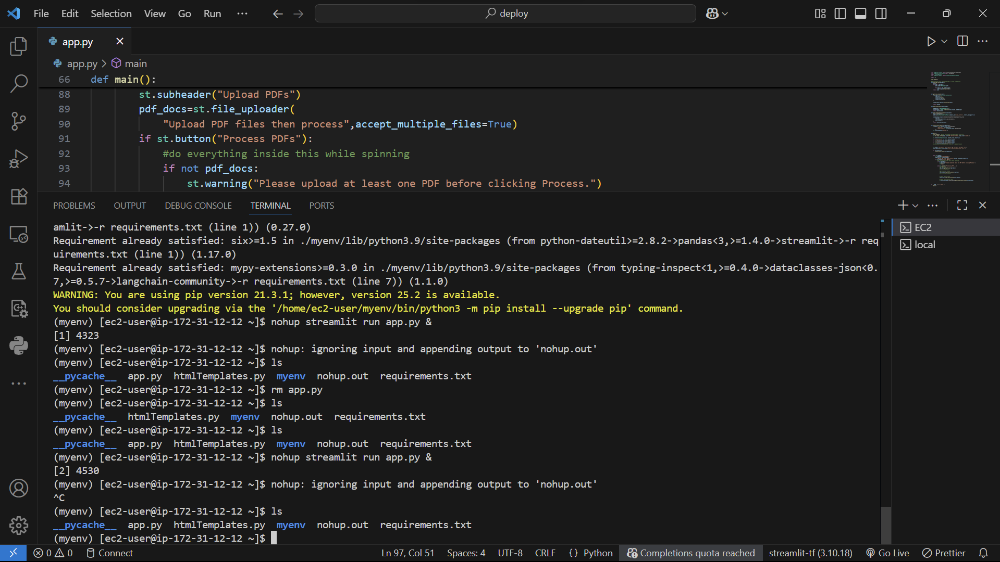
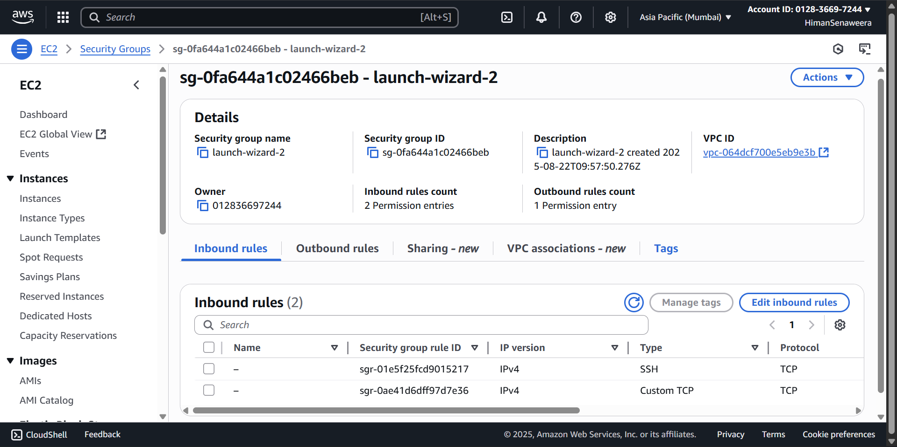
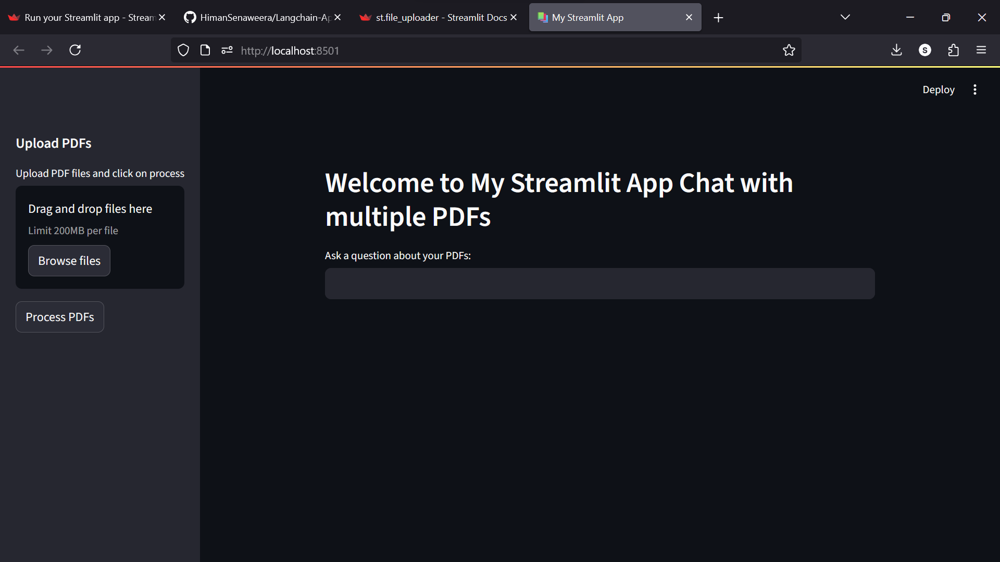
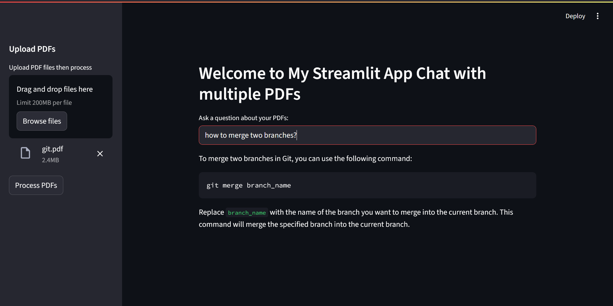

<<<<<<< HEAD
# 📚 Multi-PDF Chatbot with LangChain & Streamlit

# 🚀 Deployment: AWS EC2

## 📌 Overview

=======
#                                                                 📚 Multi-PDF Chatbot with LangChain & Streamlit  
#                                                                            🚀 Deployment: AWS EC2


## 📌 Overview
>>>>>>> fe348cc2cf23b606172509cdd7cf45a283ac3f32
This project is an interactive **PDF Q&A chatbot** built with **LangChain**, **OpenAI API**, and **Streamlit**.  
Upload one or more PDFs, the app extracts their text, splits it into manageable chunks, builds a **FAISS** vector index, and lets you ask question with conversational memory.

**Key features**
<<<<<<< HEAD

- PDF text extraction via `PyPDF2`
- Line‑aware chunking with **CharacterTextSplitter**
- **FAISS** vector library for fast similarity search
- **OpenAIEmbeddings** + **ChatOpenAI** for high‑quality answers
- **ConversationalRetrievalChain** with **ConversationBufferMemory** to keep chat context
- Simple, clean **Streamlit** UI
=======
- PDF text extraction via `PyPDF2`
- Line‑aware chunking with **CharacterTextSplitter** 
- **FAISS** vector library for fast similarity search
- **OpenAIEmbeddings** + **ChatOpenAI** for high‑quality answers
- **ConversationalRetrievalChain** with **ConversationBufferMemory** to keep chat context
- Simple, clean **Streamlit** UI 
>>>>>>> fe348cc2cf23b606172509cdd7cf45a283ac3f32

---

## 🧱 Architecture
<<<<<<< HEAD

```
PDFs → single text → text chunks → Word Embeddings → FAISS vector library → Conversation Chain
```

=======
```
PDFs → single text → text chunks → Word Embeddings → FAISS vector library → Conversation Chain
```
>>>>>>> fe348cc2cf23b606172509cdd7cf45a283ac3f32
## 📂 Conversational Chain Flow

```text
Question
   ↓
Word Embedding
   ↓
Semantic Search (FAISS)
   ↓
Ranked Results
   ↓
Text Chunks ──────→ LLM ──────→ Answer
```
<<<<<<< HEAD

### Python dependencies

=======
### Python dependencies
>>>>>>> fe348cc2cf23b606172509cdd7cf45a283ac3f32
```
streamlit
langchain
openai
faiss-cpu
PyPDF2
python-dotenv
tiktoken
```
<<<<<<< HEAD

---

## 🔧 Deployment Process

<p align="center">
  
</p>
<p align="center">
  
</p>
<p align="center">
  
</p>
<p align="center">
  
</p>

## 🌍 Access the App

=======
---
## 🔧 Deployment Process
<p align="center">
  
</p>
<p align="center">
  
</p>
<p align="center">
  
</p>
<p align="center">
  
</p>

## 🌍 Access the App
>>>>>>> fe348cc2cf23b606172509cdd7cf45a283ac3f32
You can try the deployed application here:  
👉 [Langchain PDF App](http://3.108.220.64:8501/)

---
<<<<<<< HEAD

## **Workflow in the UI**

=======
## **Workflow in the UI**
>>>>>>> fe348cc2cf23b606172509cdd7cf45a283ac3f32
1. Use the sidebar to **upload one or more PDFs** .
2. Click **“Process PDFs”** .
3. Ask questions in the text box .
4. You will Receive answers within seconds .
<<<<<<< HEAD

---

## **WebApp**

<p align="center">
  
</p>
<p align="center">
  
</p>
=======
>>>>>>> fe348cc2cf23b606172509cdd7cf45a283ac3f32
