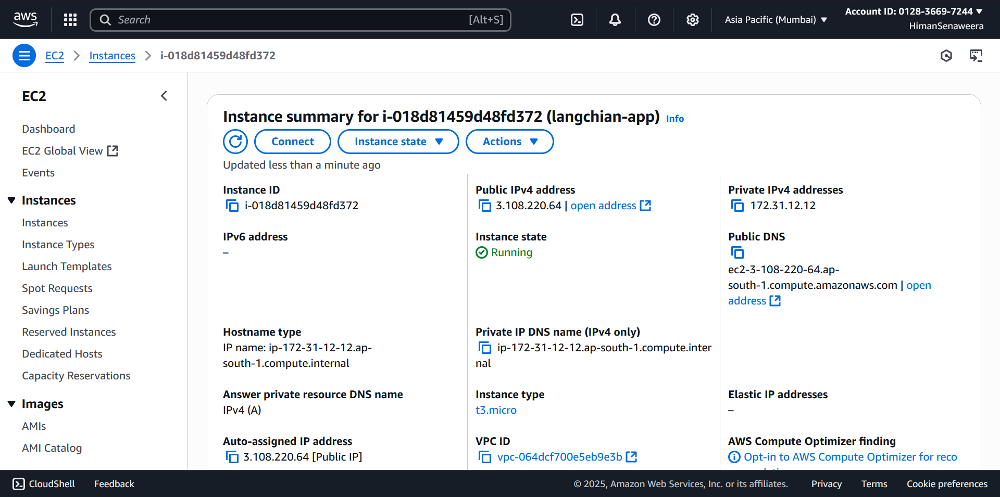
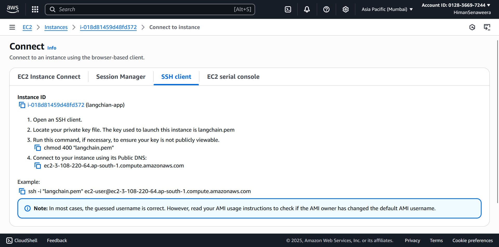
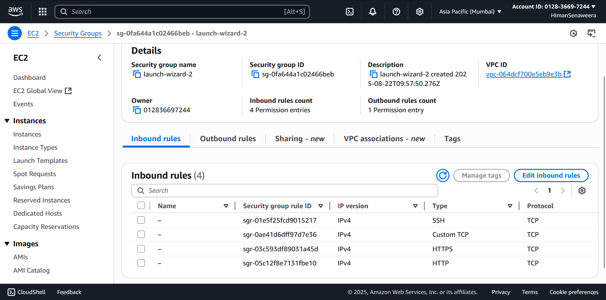

# 📚 Multi‑PDF Chatbot with LangChain & Streamlit and deploying using AWS EC2

## 📌 Overview
This project is an interactive **PDF Q&A chatbot** built with **LangChain**, **OpenAI API**, and **Streamlit**.  
Upload one or more PDFs, the app extracts their text, splits it into manageable chunks, builds a **FAISS** vector index, and lets you ask question with conversational memory.

**Key features**
- PDF text extraction via `PyPDF2`
- Line‑aware chunking with **CharacterTextSplitter** 
- **FAISS** vector library for fast similarity search
- **OpenAIEmbeddings** + **ChatOpenAI** for high‑quality answers
- **ConversationalRetrievalChain** with **ConversationBufferMemory** to keep chat context
- Simple, clean **Streamlit** UI 

---

## 🧱 Architecture
```
PDFs → single text → text chunks → Word Embeddings → FAISS vector library → Conversation Chain
```
## 📂 Conversational Chain Flow

```text
Question
   ↓
Word Embedding
   ↓
Semantic Search (FAISS)
   ↓
Ranked Results
   ↓
Text Chunks ──────→ LLM ──────→ Answer
```
### Python dependencies
```
streamlit
langchain
openai
faiss-cpu
PyPDF2
python-dotenv
tiktoken
```
## 🔧 Deployment Process
<p align="center">
  
</p>
<p align="center">
  
</p>
<p align="center">
  
</p>
<p align="center">
  
</p>

---
## 🌍 Access the App
You can try the deployed application here:  
👉 [Langchain PDF App](http://3.108.220.64:8501/)

---
**Workflow in the UI**
1. Use the sidebar to **upload one or more PDFs**.
2. Click **“Process PDFs”** – the app will extract text, chunk it, embed it, and build the FAISS vector store.
3. Ask questions in the text box (Ex: “Summarize chapter 2”).
4. You will Receive answers within seconds.

--
